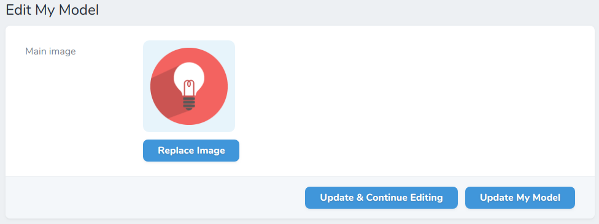
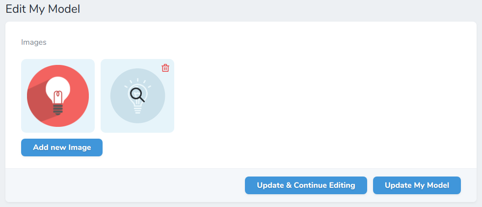

# Laravel Advanced Nova Media Library

Manage images of [spatie's media library package](https://github.com/spatie/laravel-medialibrary). Upload multiple 
images and order them by drag and drop.

This package is inspired by the basic [nova media library](https://github.com/jameslkingsley/nova-media-library) 
which lacks the upload of multiple images and ordering. This package is one of the dependencies, so you can use it 
beside this package.

## Install
```bash
composer require ebess/advanced-nova-media-library
```

## Model media configuration

Let's assume you configured your model to use the media library like following:
```php
use Spatie\MediaLibrary\Models\Media;

public function registerMediaConversions(Media $media = null)
{
    $this->addMediaConversion('thumb')
        ->width(130)
        ->height(130);
}

public function registerMediaCollections()
{
    $this->addMediaCollection('main')->singleFile();
    $this->addMediaCollection('my_multi_collection');
}
```

## Single image upload



```php
use Ebess\AdvancedNovaMediaLibrary\Fields\Images;

public function fields(Request $request)
{
    return [
        Images::make('Main image', 'main') // second parameter is the media collection name 
            ->thumbnail('thumb') // conversion used to display the image
            ->rules('required'), // validation rules
    ];
}
```
 
## Multiple image upload

If you enable the multiple upload ability, you can **order the images via drag & drop**.



```php
use Ebess\AdvancedNovaMediaLibrary\Fields\Images;

    public function fields(Request $request)
    {
        return [
            Images::make('Images', 'my_multi_collection'), // second parameter is the media collection name
                ->conversion('medium-size') // conversion used to display the "original" image
                ->thumbnail('thumb') // conversion used to display the image
                ->multiple() // enable upload of multiple images - also ordering
                ->fullSize() // full size column
                ->rules('required|size:3'), // validation rules for the collection of images
                // validation rules for the collection of images
                ->singleImageRules('dimension:min_width=100'),
        ];
    }
```

## Names of uploaded images

The default filename of the new uploaded file is the original filename. You can change this with the help of the function `setFileName`, which takes a callback function as the only param. This callback function has three params: `$originalFilename` (the original filename like `Fotolia 4711.jpg`), `$extension` (file extension like `jpg`), `$model` (the current model). Here are just 2 examples of what you can do:

```php
// Set the filename to the MD5 Hash of original filename
Images::make('Image 1', 'img1')
    ->setFileName(function($originalFilename, $extension, $model){
        return md5($originalFilename) . '.' . $extension;
    });
    
// Set the filename to the model name
Images::make('Image 2', 'img2')
    ->setFileName(function($originalFilename, $extension, $model){
        return str_slug($model->name) . '.' . $extension;
    });
```

## File media management

To manage files just use the [nova media library](https://github.com/jameslkingsley/nova-media-library) fields which
are already required in this package.

